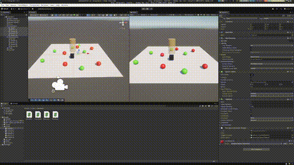
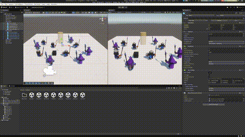
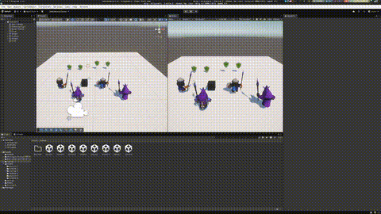
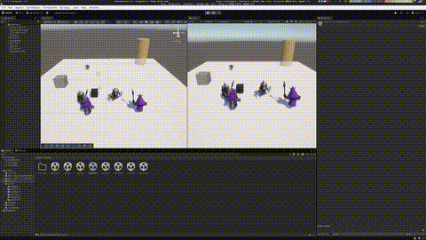
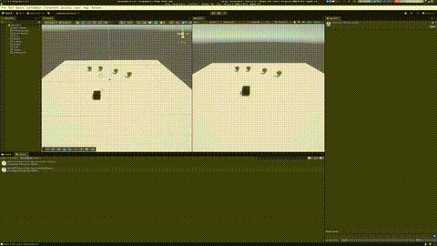
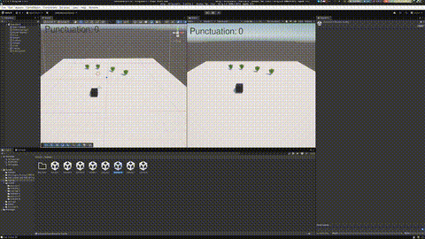
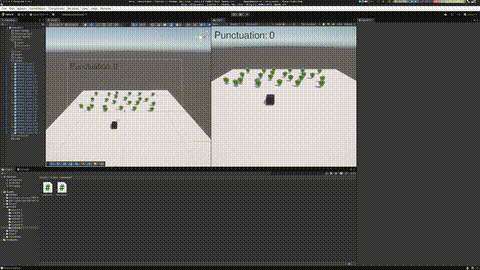

## Exercise 1:

## Exercise 2:

## Exercise 3:

## Exercise 4:

## Exercise 5:

## Exercise 6:

## Exercise 7:

## Exercise 8:

It not done

## Exercise 9:

The exercise 9 is the same as exercise 3
